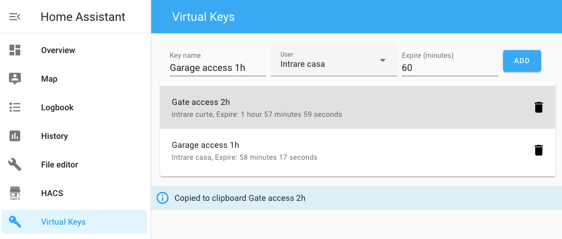

# virtual-keys
[](https://github.com/hacs/integration)

Create login link for [Home Assistant](https://www.home-assistant.io/) that you can share with guests.



# Installation

## HACS installation

* add "Custom repositories" to HACS, paste the URL of this repository and select "Lovelace" as category

* go to HACS -> Frontend, Explore and Download Repositories, search for "virtual keys" and install it

* in HACS "Custom repositories" delete the URL of this repository

* add "Custom repositories" to HACS, paste the URL of this repository and select "Integration" as category

* go to HACS -> Integrations, Explore and Download Repositories, search for "virtual keys" and install it

Add to `configuration.yaml`:

```yaml
virtual_keys:

panel_custom:
  - name: virtual-keys-panel
    require_admin: true
    url_path: virtual-keys
    sidebar_title: Virtual Keys
    sidebar_icon: mdi:key-variant
    module_url: /local/community/virtual-keys.js
```

* restart Home Assistant
